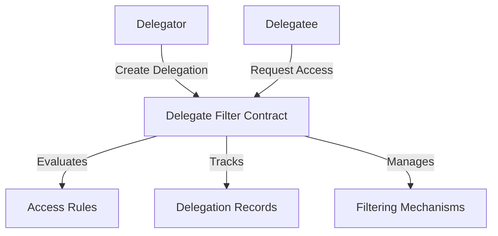

# Delegate Filter

A flexible and secure Clarity smart contract for managing delegated access and filtering on the Stacks blockchain.

## Overview

Delegate Filter provides a robust mechanism for creating granular, programmable delegations with advanced filtering capabilities. The contract enables:

- Fine-grained access control delegation
- Flexible permission management
- Secure, configurable filtering mechanisms
- Transparent delegation tracking
- Extensible rule-based access systems

## Architecture

The contract implements a sophisticated delegation and filtering system with multiple layers of access control.



### Core Components

1. **Delegation Registry**: Tracks active delegations
2. **Access Rule Engine**: Evaluates complex permission conditions
3. **Filtering Mechanism**: Applies granular access restrictions
4. **Auditing System**: Maintains delegation history

## Contract Documentation

### Main Contract: delegate-filter.clar

A comprehensive solution for managing delegated access with advanced filtering.

#### Key Features

- Customizable delegation rules
- Multi-level permission management
- Secure, programmable access control
- Comprehensive delegation tracking
- Flexible filtering strategies

#### Access Control

- Delegator: Creates and manages delegations
- Delegatee: Requests and uses delegated permissions
- Contract Owner: Manages global settings

## Getting Started

### Prerequisites

- Clarinet
- Stacks wallet
- Basic understanding of delegation concepts

### Basic Usage

1. **Create a Delegation**:
```clarity
(contract-call? .delegate-filter create-delegation 
    delegatee 
    permissions 
    filters)
```

2. **Check Delegation Status**:
```clarity
(contract-call? .delegate-filter get-delegation delegatee)
```

3. **Revoke Delegation**:
```clarity
(contract-call? .delegate-filter revoke-delegation delegatee)
```

## Function Reference

### Delegation Management

```clarity
(create-delegation delegatee permissions filters)
(update-delegation delegatee new-permissions new-filters)
(revoke-delegation delegatee)
```

### Access Control

```clarity
(check-access delegatee resource action)
(get-delegation delegatee)
```

## Development

### Testing

1. Clone the repository
2. Install Clarinet
3. Run tests:
```bash
clarinet test
```

### Local Development

1. Start Clarinet console:
```bash
clarinet console
```

2. Deploy contract:
```bash
clarinet deploy
```

## Security Considerations

### Delegation Safety
- Strict permission validation
- Granular access control
- Immutable delegation rules

### Access Restrictions
- Comprehensive filtering mechanisms
- Prevention of unauthorized access
- Transparent delegation tracking

### Limitations
- Delegation rules are statically defined
- No dynamic runtime permission modification
- Access checks are deterministic